

	
# RobotVQA: A Scene-Graph- and Deep-Learning-based Visual Question Answering System for Robot Manipulation

   
# Introduction 
 

   EASE is the initiative of the interdisciplinary research center EASE at the University of Bremen that aims at enabling robots to competently perform human-scale daily manipulation activities such as cooking in an ordinary kitchen. However, to complete such tasks, robots should not only exhibit standard visual perception capabilities such as captioning, detection, localization or recognition, but also demonstrate some cognitive vision, in which all these capabilities including considerable reasoning are integrated together, so that semantically deep understanding of the unstructured and dynamic scene can be reached.
   
   In this thesis, we formulate the underlying perception problem of scene understanding as three subproblems:
- **Objects description:** we design and train a deep convo-neural network to provide an end-to-end dense description of objects in the scene. 
- **Relationships description:** we design and train a relational neural network for computing relationships among objects in the scene. Relationships essentially encode scale-invariant relative positioning (on-the, in-the, left-of, under-the, ...) as well as composition (has-a). The network takes as inputs the input image code(Referential) and the codes(Mask(local infos)+Pose) of two objects in the image, then outputs the most likely relationship between both objects. Note that this can be regarded as a soft or more semantical variant of the hard object pose estimation performed by the object describer mentioned above. 
- **Visual Question Answering:** Allowing the robot control program to only access needed information eases programming, boosts realtimeness and makes robot control program further independent of the perception system and therefore more generic. Moreover, answering question based on structured queries and structured complete information (scene graph) is more robust and efficient than brute force approaches that tend to take unstructured queries as input to to output unstructured answers.

For achieving a good reasoning about scenes, the first two tasks including object description task's subtasks are integrated together into a single multi-task deep convo-neural network where training and inference take place end-to-end. 

As output, the system returns a scene graph. A scene graph is a directed graph, whose nodes and edges respectively encode objects description and relationships among objects in the scene. This scene graph is then used as informatioa basis to solve the third task. The figure below illustrates the concept. 

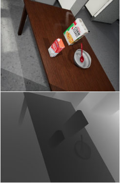

# 1. Contribution

The contribution of this thesis is twofold:
- **A single novel Model that massively describes visual scenes to be able to address general visual question answering tasks for robots during manipulation tasks**: given a scene, the model outputs each object's category, color, shape, material, pose, bounding box, mask, openability and spatial relationships to other objects.

- **Demonstration of full machine learning transferability from virtual worlds to real worlds:**  the real world is virtualized, a big rich dataset is collected from the virtual world, the above model is trained on and tested in the real world.

The following figure graphically illustrates and summarizes our contributions.

The pdf-version of the thesis can be found at [thesis.pdf](Literature/thesis.pdf)

# 2. Typical Scene 

  
   The following figure briefly illustrates the concept of scene graph.The system operates in two modes: either with depth information or without.

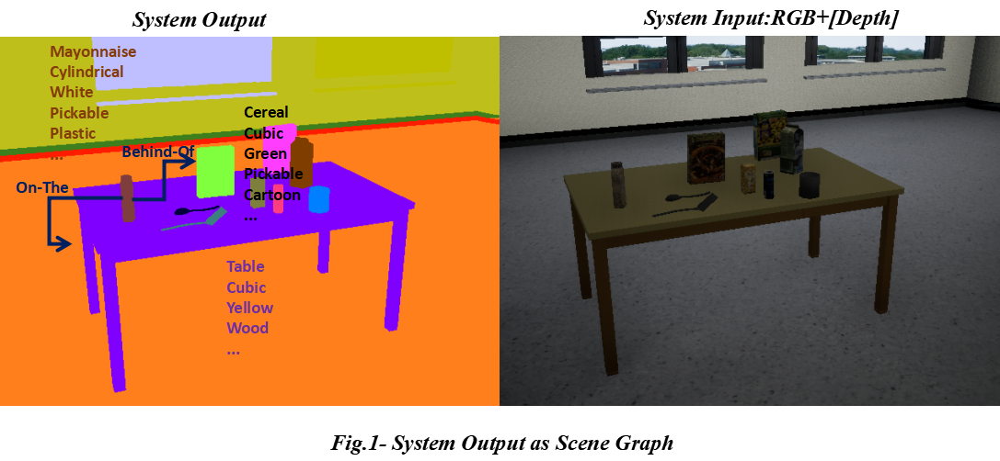

# 3. Multi-Task Deep Convo-Neural Network

   Our model, from a broader view,  works as follows:

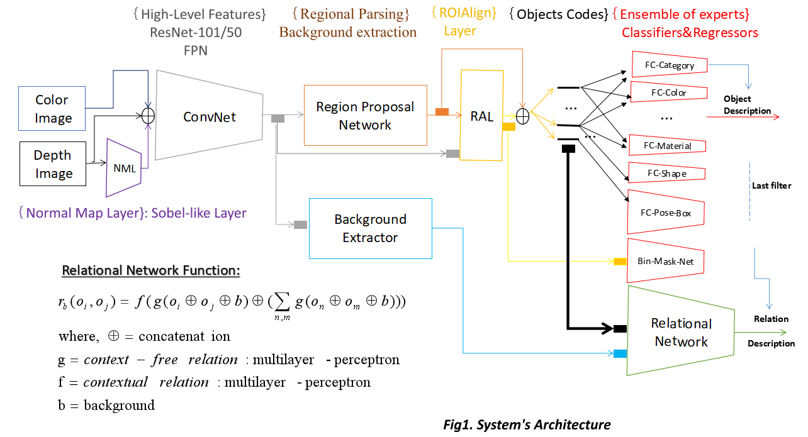

# 5. Frameworks

   We make use of the following Frameworks:

- **PythonLibs, LabelMe, Unreal Engine and UnrealCV:** to build the dataset 
- **PythonLibs, TensorFlow and Caffe:** to build the deep convo-neural and relational networks, train them and make inferences

# 6. Dataset 

   The structure of the visual dataset can be found at [dataset's structure](dataset/datasetStructure.txt). This file deeply specifies the structure of objects in the scene and the image and information types needed to learn the structure of objects. For building a huge dataset, we model the environment of the target robot in Unreal Engine4.16, which is a photorealistic game engine allowing therefore efficient transfer learning. Then,  we write a software for an end-to-end construction of the dataset starting from the automatic camera navigation in the virtual environment till the saving of scene images and annotations. To augment the annotation of the collected images with relationships, we built a flexible software. The use of this software is definitively compulsory when dealing with some external images. Our annotation softwares can be found at [automatic dataset generator](tools/generateDataset.py) and [manual dataset generator](tools/relationAnnotator.py) . An example of annotation can be downloaded from [example of annotation](dataset/datasetExample1.zip)(**zip file**).

   The above picture shows how realistic the unreal scene can be:
   
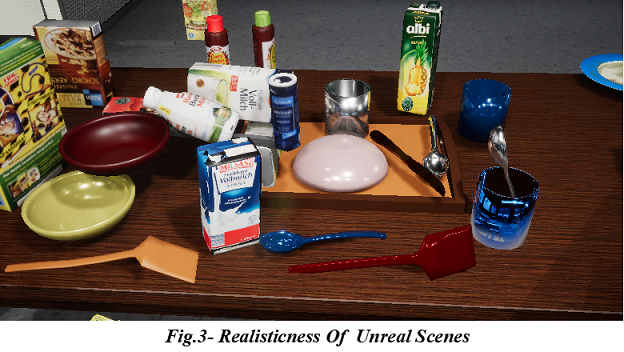   
  
  
   The following images depict the annotation of a typical scene from objects to relationships description:

   

   

 

# 7. Object Color Estimation: Learning vs Engineering

   In this thesis, we semantically select as many color classes as needed, which are the basic/standard colors set up by the **ISCC–NBS System**, to colourfully label the robot environment. These colors are **red**, **blue**, **green**, **yellow** ...
   
**Engineering approach:** we assume that the pixels's colors are normally distributed as it usually seems to be the case for natural images(Gaussian mixtures). We find the most frequent pixel color(RGB) and compute the nearest color class to the most frequent pixel color. The color class is then considered as the color of the object. By modeling colors as 3D-vectors/points in the **Lab-Color space**, we define a consistent distance between two colors, which captures human visual ability for color similarity and dissimilarity. 
- Quantitatively more precise than human vision, however fails to capture quality: **too few qualitative classes(only 12) and very low features(Gaussian mean of pixel values)**
- Very sensitive to noise: **shadow, very strong mixture of colors**
- Very simple and fast.

**Learning approach:** By building the dataset for learning, we objectively assign color classes to objects and after the training, the network is able to qualitatively appreciate the color of objects in the scene.
- Very powerful: end-to-end rational color estimation only based on objective description of data
- Qualitatively matches human vision **(color constancy)**
- More complicated and costlier: objective description of data, network, training and estimation.

# 8. Object Pose Estimation: Position, Orientation and Cuboid
                 
Refering to the best of our knowledge, we are the first to design an **end-to-end object pose estimator** based on Deep-Learning. From Unreal Engine, we sample images annotated with objets and cameras' poses within the virtual world coordinate system. Then we refine the annotation by mapping the objects' poses  from the world's coordinate system into the camera's coordinate system. The end-to-end object pose estimator takes as input an image and outputs the poses of objects on the image. Futhermore, the estimator also outputs the minimal cuboid enclosing an object.
   
A brief comparison of our learning approach to other traditional approaches on pose estimation follows:

**Traditional approach:** state of the art as PCL requires a lot of engineering
- A 3D-Model for each objects, explicit features extraction: almost manually
- Calibration(camera)
- Clustering-based scene segmentation: imposes some restrictions on the scene configuration(colorfulness, sparseness, ...)

**Learning approach:**
- very natural: only based on data
- No engineering effort: end to end
- Almost no restriction on the scene configuration(colorfulness, sparseness)
- Huge dataset: no problem, we do it almost automatically

The following figure illustrates how we compute the objects' poses for annotation/learning:

Given that the dataset sampling camera's intrinsic matrix might be different from the ones of the robot camera, we evaluate the
intrisic matrices *R1,R2* respectively of the sampling camera and the robot camera once and properly map the outputted position *(X,Y,Z)* by the network as *inverse(R2)xR1x(X,Y,Z)*. The following figures depicts a demonstration of the camera projection.

# 9. Object Shape Recognition

As far as 3D-shape recognition in Computer Vision is concerned, our main contribution in this thesis is the setup of a pure learning-based or data-driven 3D-shape recognizer, which was not at least deeply conducted so far. In contrast to most existing methods, which are subjects to multiple restrictions such as object orientations, lighting and colors due to engineered feature extraction such as shape descriptors, our method naturally establishes a context-free correlation between objects and 3D-shapes. 

However, to reach an efficient(speed and accuracy) deep learning, it is recommended to supervise it as much as possible. That is by feeding the network with as much information as possible, by pretraining its submodules or by adjusting the general structure of the network to avoid useless computation.

Given an RGB-D image in our context, we design a Sobel/Scharr-like convolution layer at the entry of the network to compute from the Depth(D)-map a normal map, which seems to convey more information about the shape to the Human visual system. The following figure illustrates the idea.

# 10. Materials, Graspability, Pickability, Stackability and Openability

As cleary stated in the introduction, we aim at developing a cognitive vision module for human-like manipulation activities. Therefore, one of our goal is to design a mechanism being also able to track non-standard visual properties namely the material, the graspability, the stackability and the openability of objects in the scene, which actually play a crucial role for reasoning about how to handle the objects during the manipulation phase.

- **Materials:**  we further distinguish external material from internal material of an object. For instance a bottle of juice can be externally seen as plastic but internally as liquid. While the external material may inform about how much pressure the object should undergo and what can be put inside the object, the internal material may inform about how to carry, empty or fill the object(container). As far as the computation of this feature is concerned, the object surface's behavior faced to light can be determinant.

- **Graspability:** another important thing to know about objects in the manipulation environment is  whether or not they can be grasped: we call this feature graspability. It is the quality of an object to be held purposely by the robot arm. It can be inferred but not systematically from other object' properties such as *pickability, stackability or openability*. The system can also find deep correlation factors such as shape, location or function of objects to track this feature.

- **Pickability:** this feature is very similar to *graspability* however different. Pickability of an object refers to how easy the object can be grasped, lifted up and moved. This feature is very common to small objects and can be inferred from the object's shape, 
size or material.

- **Stackability:**  an object is stackable if and only if another similar object can be placed on top of it. This is very important when tryng to free the place occupied by objects. Determinants for this feature can be the object's shape, flatness or openness.

- **Openability:** this feature informs us about whether or not an object can be opened. This is very important for getting into objects such as a bottle or fridge 

# 11. Objects Categories

In our virtual environment, we try to categorize objects as abstractly as possible to capture generality. That is, instead of categorizing an object as **FridgeDrawer**, it would be much better to  simply categorize it as **Drawer**, because there are only few instances of the category **FridgeDrawer** in the environment but so many instances of particular drawers. As far as the complementarity of **Fridge** is concerned, this is ensured by the relationship **has(Fridge, Drawer)**. This is also frequently observed with packaged food items: since the overall visual configuration of packages of a category(Coffee) can drastically vary, what would be the most common sufficient features to most packages? Observations show that the most common sufficient features to most packages are neither the package's shape, nor its color, nor the words written on it but rather the image depicting the content of the package. This discovery merely reinforces the idea, that objects should be carefully categorized to enable an efficient machine learning.

# 12. Relationships Among Objects

Complex manipulation of objects in an environment does not merely require an understanding of separated objects in the scene, but also a good understanding of how those objects are related and interact to and with each other. In this thesis, we focus essentially on spatial relationships, which provide the manipulator with sufficiently great insights into the objects' space occupancy and how to navigate in the scene.  

We distinguish almost 8 types of relations namely {left, rigth, over, under, on, front, behind,in} between any pair of distinct objects in the scene. For N objects, the number of pairs being approximatedly O(NxN) leads directly to O(8xNxN) relations which become quickly intractable at every stage(annotation, training, evaluation) of the system's pipeline. Based on many tricks such as the transitivity rule,  We address this problem by defining an efficient format for spatial relationships description which significantly reduce the complexity to O(N) in average. The following picture demonstrates the completeness of the group of relation types {on, in, left, front}.

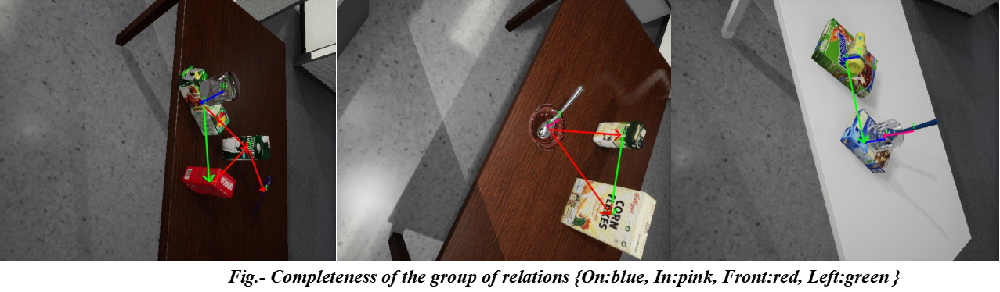

# 12. Some Provisional Results

To watch the results video, please click on ***the following image link and then on View Raw***.

[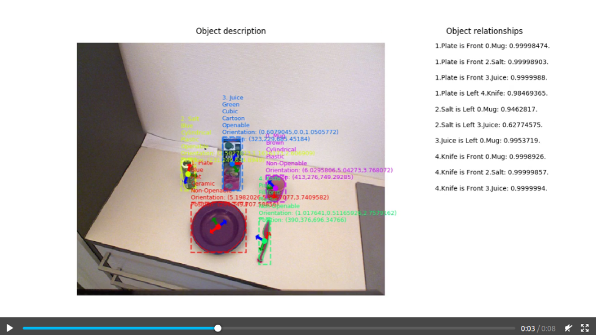](images/test7.mp4 "Results video1")
[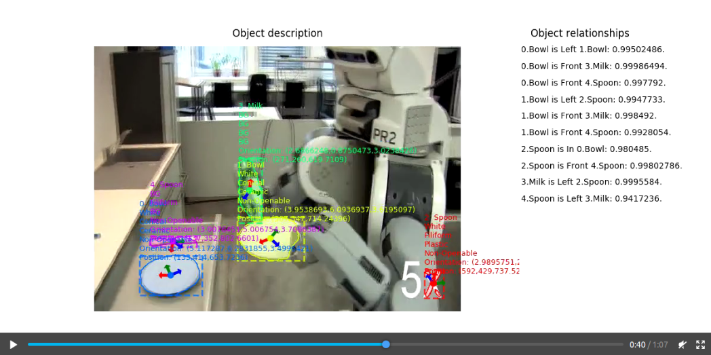](images/test3.mp4 "Results video2")
[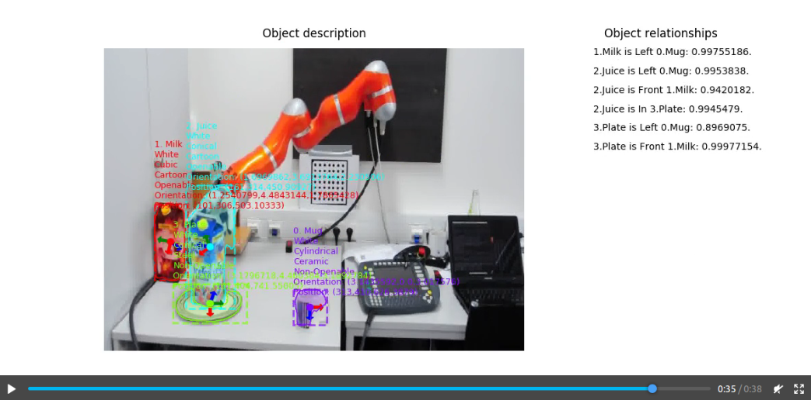](images/test8.mp4 "Results video3")
[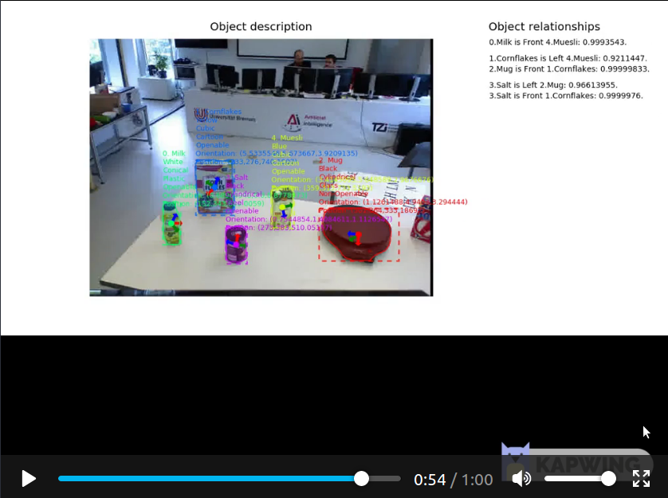](images/final_5cdeb4585c5c0a0014a5cf0e_549557.mp4 "Results video4")
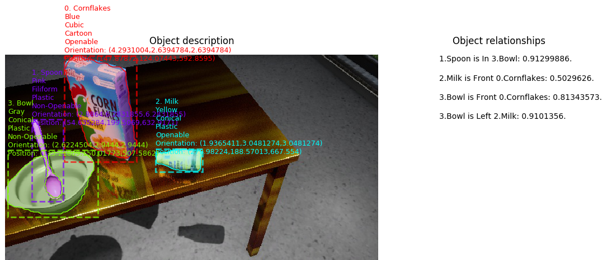
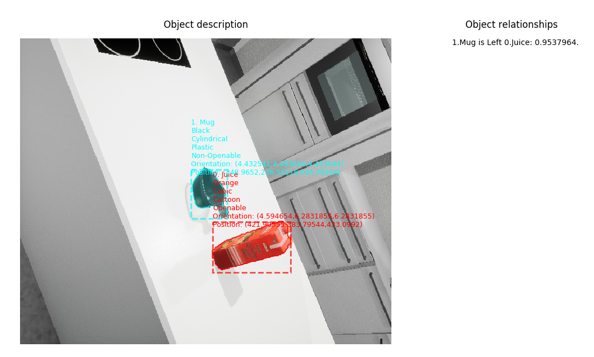
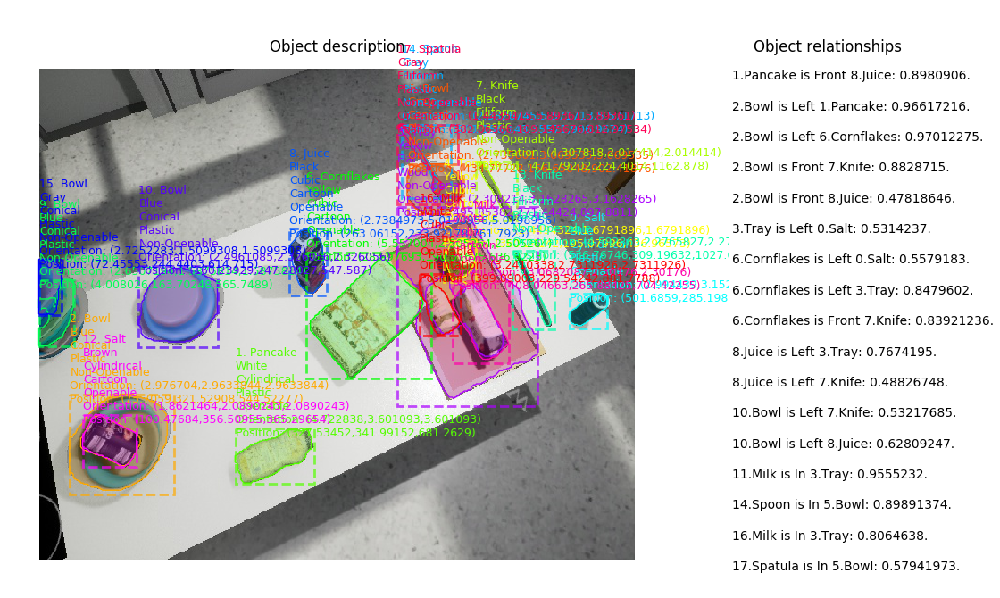
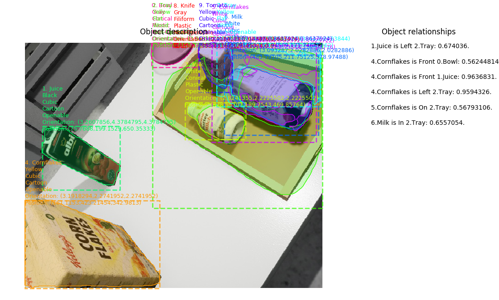

# 13. Installation 

1. Install python 2.7.12: found at https://www.python.org/downloads/release/python-2712/

2. Install pip 18.1: found at https://pip.pypa.io/en/stable/installing/

3. If your computer supports NVDIA GPGPU(s) with compute capability>=3.0 and you would like to exploit it for speeding up, then:
	
	3.1. Install CUDA 9.0: found at https://developer.nvidia.com/cuda-90-download-archive

	3.2. Install cuDNN 7.0.4: found at https://developer.nvidia.com/rdp/cudnn-archive

4. Install tensorflow 1.12.0 or 1.13.1: found at https://www.tensorflow.org/install/source

5. Using the pip utilitty, install the following python package from the command-line terminal:

	5.1. pip install numpy==1.14.3

	5.2. pip install scipy==1.1.0

	5.3. pip install keras==2.1.6

	5.4. pip install h5py==2.7.1

	5.5. pip install pillow==3.1.2

	5.6. pip install unrealcv==0.3.10

	5.7. pip install opencv-python==4.0.0.21

	5.8. pip install matplotlib==1.5.1

	5.9. pip install scikit-image==0.13.1

# 14 Test                     

To test RobotVQA: inference on images in folder  testsamples.

1. Open the command-line terminal and set the current directory to the subdirectory tools of the directory RobotVQA.

2. Run the file tester.py.

3. To customize, read the readme file in the folder directory s well as the comments in programs.

4. The results will be graphically displayed and subsequently saved into the subfolder result of the folder RobotVQA

Note:  * RobotVQA's parameter files (.h5) are stored in the subfolders logs (RGBD mode) and logs1 (RGB mode). 

# 15. Training  

To train RobotVQA: optimize parameters on a dataset.

1. Open the command-line terminal and set the current directory to the subdirectory tools of the directory RobotVQA.

2. Run the file launcher.py. 

Note: 

- *make sure that in the function call train(...) within launcher.py, that the op_type variable is set to training.*

- *However, Since the proper data (images) are so big and lie on the IAI Bremen's server, a real training would require to download them.*

- *While saving the downloaded datasets on your machine, the path should be preserved: if /mnt/prog/dataset is the path on the server, then it should also be the case on your machine.*

- *The first two parameter of train(...) are respectively the training dataset (train_set) and the validation dataset (val_set)*
	  
- *RobotVQA's parameter files (.h5) are stored in the subfolders logs (RGBD mode) and logs1 (RGB mode). 

# 16. Evaluation 

To validate RobotVQA: test the system on a dataset and return the performance metrics.

1. Open the command-line terminal and set the current directory to the subdirectory tools of the directory RobotVQA.

2. Run the file launcher.

Note: 

- *make sure that in the function call train(...) within launcher.py, that the op_type variable is set to 'training'.*

- *However, Since the proper data (images) are so big and lie on the IAI Bremen's server, a real training would require to download them.*

- *While saving the downloaded datasets on your machine, the path should be preserved: if /mnt/prog/dataset is the path on the server, then it should also be the case on your machine.*

- *The first two parameter of train(...) are identical (val_set), (val_set).*
	  
- *RobotVQA's parameter files (.h5) are stored in the subfolders logs (RGBD mode) and logs1 (RGB mode). 

3. At the end of the evaluation, the results are appended to a binary file named validation.data and located in the folder RobotVQA

4. To read the content of that file in text form on the screen, use the function loadFile(...) within RobotVQA/tools/utils.py.

