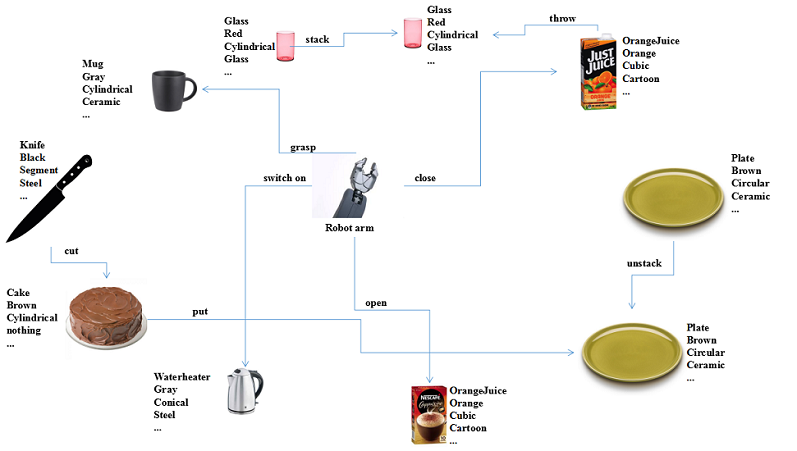
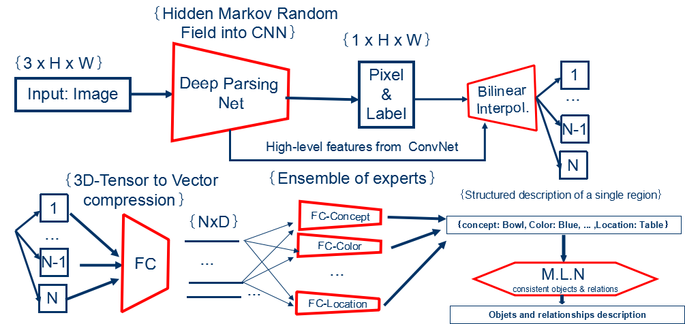

# RobotVQA

**1.   Robohow is the European Research Project that aims at enabling robots to competently perform human-scale daily manipulation activities such as cooking in an ordinary kitchen. However, to complete such tasks, robots should not only exhibit standard visual perception capabilities such as captioning, detection, localization or recognition, but also demonstrate some cognitive vision, in which all these capabilities including considerable reasoning are integrated together, so that semantically deep understanding of the unstructured and dynamic scene can be reached.** 
   
   In this thesis, we formulate the underlying perception problem of scene understanding as two subproblems:
- **Objects description:** we design and train a deep convo-neural network to provide an end-to-end dense description of objects in the scene. Since context-independent annotation of objects in the scene can be done almost automatically, we can easily generate a big dataset and take advantage of deep learning.
- **Relationships description:** we design and train a markov logic network to provide a relevant and consistent description of relationships among objects in the scene. Markov logic networks are suitable for reasoning about relationships among objects, very flexible(few rules for so many behaviors) and the separation of this module from the object description module enables modularity(changes in the one module does not affect the other module).

**2. The following figure briefly illustrates the concept:**

**3. Our model works as follows:**

**4. An illustrative markov logic network for consistent description of objects as ell as relationships among them follows:**

**Types declaration**

*object={BOWL_1,SPOON_2,MUG_3,...}*

*name={SPATULA, BOWL, SPOON, KNIFE, MUG,...}*

*pickability={TRUE, FALSE}*

*inMaterial={SOLID, LIQUID, GAZ, POWDER}*

*outMaterial={CERAMIC, WOOD, GLASS, STEEL, PLASTIC, CARTOON}*

*shape={CUBIC, CYLINDRICAL, CONICAL, FLAT, FILIFORM, SPHERICAL, PYRAMIDAL}*

**Predicates declaration**

*objectName(object,name)*

*objectShape(object,shape)*

*objectPickability(object, pickability)*

*objectOutMaterial(object, outMaterial)*

*objectInMaterial(object, inMaterial)*

*object(object)*

*container(object)*

*throw(object,object)*

**Rules declaration**

*Vx(objectName(x, SPATULA) => (objectOutMaterial(x, WOOD) v objectOutMaterial(x, STEEL) v objectOutMaterial(x, PLASTIC))* , **weight=?**

*Vx(objectName(x, SPATULA) => objectInMaterial(x, SOLID))* , **weight=?**

*Vx,y,m,n(objectName(x, m) ^ objectName(x, n) ^ (n=m) => (x=y))* , **weight=+infinity (hard constraint)**

*Vx((objectName(x, MUG) v objectName(x, BOWL) v objectName(x, GLASS)) => container(x))* , **weight=?**

*Vx,y(container(x) ^ objectInMaterial(y, LIQUID) ^ (x=/=y) => throw(y,x))* ,  **weight=?**

**5. We make use of the following Frameworks:**

- **Unreal Engine and UnrealCV:** to partially build the visual datasets
- **TensorFlow and Caffe:** to build the deep convo-neural network, train it and make inferences
- **Pracmln and Alchemy:** to build the markov logic network, train it and make inferences 

**6. The structure of the visual dataset can be found at [dataset's structure]**(https://github.com/fkenghagho/RobotVQA/blob/master/dataset/datasetStructure.txt). And an example of annotation can be downloaded from [example of annotation](https://github.com/fkenghagho/RobotVQA/blob/master/dataset/datasetExample.zip)

